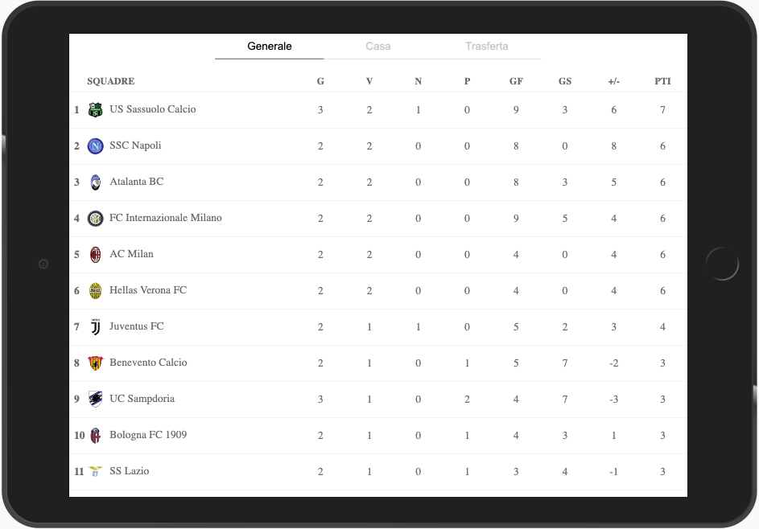

# Football Standings Widget
[](https://www.npmjs.com/package/gm-football-standings)

[](https://github.com/ellerbrock/open-source-badge/)
[](https://www.sphinx-doc.org/)



Football Standings Widget shows the standings of the most important football leagues.
You can integrate this widget in your Web Application using NPM or using the CDN. The widget works with Angular, React and others modern frontend Frameworks or libraries.
The widget was created using Mobile first approach and is also customizable.

**THE PROJECT IS CURRENTLY WORK IN PROGRESS**

## Summary
- [Getting started](#getting-started)
- [Available competitions](#available-competitions)
- [Integration](#integration)
- [Browsers support](#browsers-support)
- [Tech stack](#tech-stack)

## Getting started
To use our widget you need to enable a public key from [football-data](https://www.football-data.org/).

## Available competitions
| Key | Competition |
| ------ | ------ |
| SA | Serie A |
| PL | Premier League |
| PD | Liga |
| BL1 | Bundesliga |
| FL1 | Ligue |
| DED | Eredivise |

## Integration

## NPM
```sh
npm i --save gm-football-standings
```

### Angular
```javascript
// APP.MODULE.TS
import { BrowserModule } from '@angular/platform-browser';
import { CUSTOM_ELEMENTS_SCHEMA, NgModule } from '@angular/core';
import { AppComponent } from './app.component';

@NgModule({
  declarations: [AppComponent],
  imports: [BrowserModule],
  bootstrap: [AppComponent],
  schemas: [CUSTOM_ELEMENTS_SCHEMA],
})
export class AppModule {}

// MAIN.TS
import { enableProdMode } from '@angular/core';
import { platformBrowserDynamic } from '@angular/platform-browser-dynamic';

import { AppModule } from './app/app.module';
import { environment } from './environments/environment';

import { defineCustomElements } from 'gm-football-standings/loader';

if (environment.production) {
  enableProdMode();
}

platformBrowserDynamic().bootstrapModule(AppModule)
  .catch(err => console.log(err));
defineCustomElements();

// APP.COMPONENT.HTML
<gm-football-standings competition="SA" season="2019" key="public-key-here"></gm-football-standings>
```

### React
```javascript
import React from 'react';
import ReactDOM from 'react-dom';

import { defineCustomElements } from 'gm-football-standings/loader';

ReactDOM.render(
    <div>
      <gm-football-standings competition="SA" season="2019" key="public-key-here">
      </gm-football-standings>
    </div>,
    document.getElementById('root'));

defineCustomElements();
```

## CDN
```html
<body>
    <gm-football-standings competition="SA" season="2019" key="public-key-here">
    </gm-football-standings>
    
    <script type="module" src="https://unpkg.com/gm-football-standings/dist/gm-football-standings/gm-football-standings.esm.js"></script>
</body>
```

## Browsers support
:white_check_mark: Chrome
<br/>
:white_check_mark: Firefox
<br/>
:white_check_mark: Safari
<br/>
:white_check_mark: Edge (New Version)

## Tech stack:
- WebComponents
- Typescript
- StencilJS
- Sass
- Css Variables

Keep calm and code!
<br>
[](https://github.com/ellerbrock/open-source-badge/)