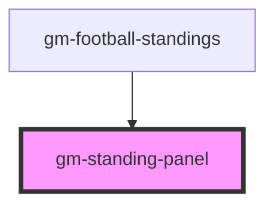

# gm-standing-panel

<!-- Auto Generated Below -->

## Events

| Event         | Description | Type                  |
| ------------- | ----------- | --------------------- |
| `switchPanel` |             | `CustomEvent<string>` |

## Dependencies

### Used by

 - [gm-football-standings](..)

### Graph

----------------------------------------------

*Built with [StencilJS](https://stenciljs.com/)*
