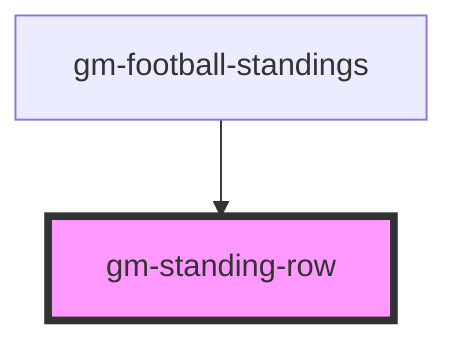

# gm-standing-row

<!-- Auto Generated Below -->

## Properties

| Property         | Attribute         | Description | Type     | Default     |
| ---------------- | ----------------- | ----------- | -------- | ----------- |
| `draw`           | `draw`            |             | `number` | `undefined` |
| `goalDifference` | `goal-difference` |             | `number` | `undefined` |
| `goalsAgainst`   | `goals-against`   |             | `number` | `undefined` |
| `goalsFor`       | `goals-for`       |             | `number` | `undefined` |
| `imageUrl`       | `image-url`       |             | `string` | `undefined` |
| `lost`           | `lost`            |             | `number` | `undefined` |
| `name`           | `name`            |             | `string` | `undefined` |
| `playedGames`    | `played-games`    |             | `number` | `undefined` |
| `points`         | `points`          |             | `number` | `undefined` |
| `position`       | `position`        |             | `number` | `undefined` |
| `won`            | `won`             |             | `number` | `undefined` |

## Dependencies

### Used by

 - [gm-football-standings](..)

### Graph

----------------------------------------------

*Built with [StencilJS](https://stenciljs.com/)*
