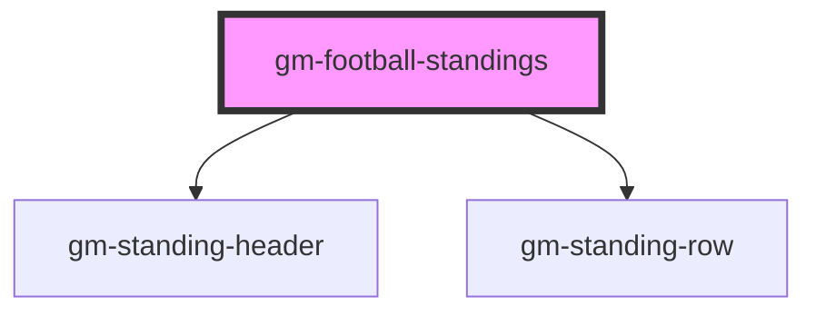

# gm-football-standings

<!-- Auto Generated Below -->

## Properties

| Property      | Attribute     | Description | Type     | Default     |
| ------------- | ------------- | ----------- | -------- | ----------- |
| `competition` | `competition` |             | `string` | `undefined` |
| `publicKey`   | `public-key`  |             | `string` | `undefined` |
| `season`      | `season`      |             | `number` | `undefined` |

## Dependencies

### Depends on

- [gm-standing-header](gm-standing-header)
- [gm-standing-row](gm-standing-row)

### Graph

----------------------------------------------

*Built with [StencilJS](https://stenciljs.com/)*
